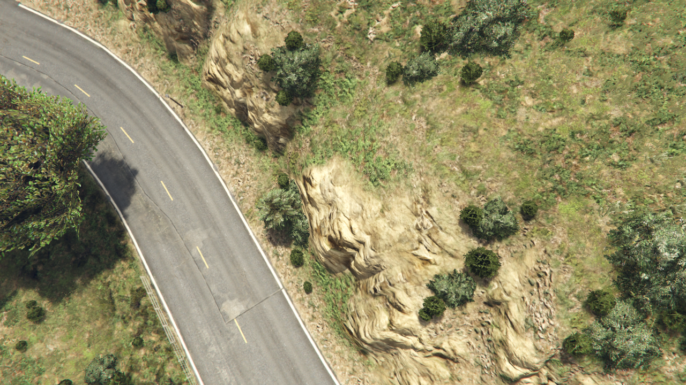
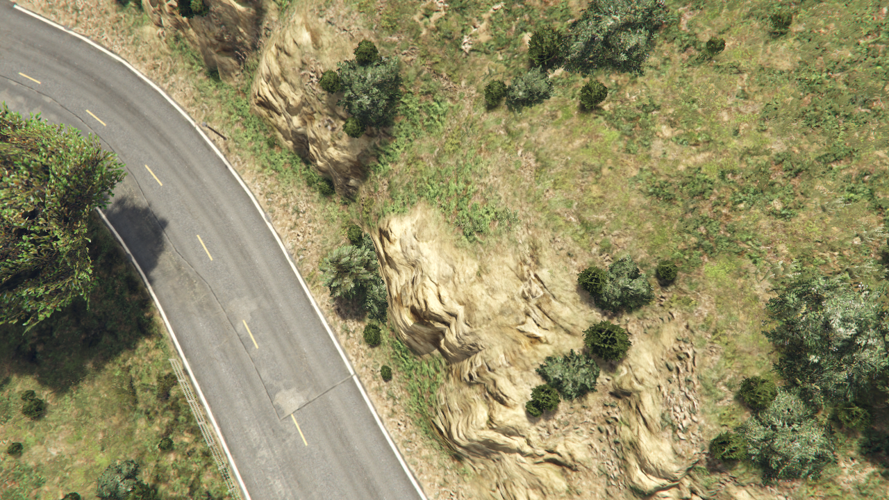
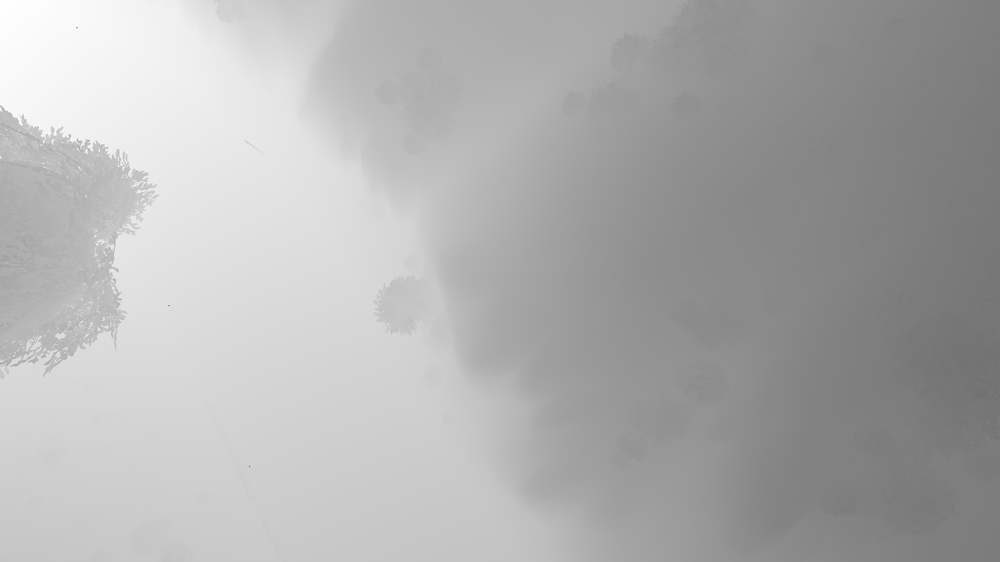
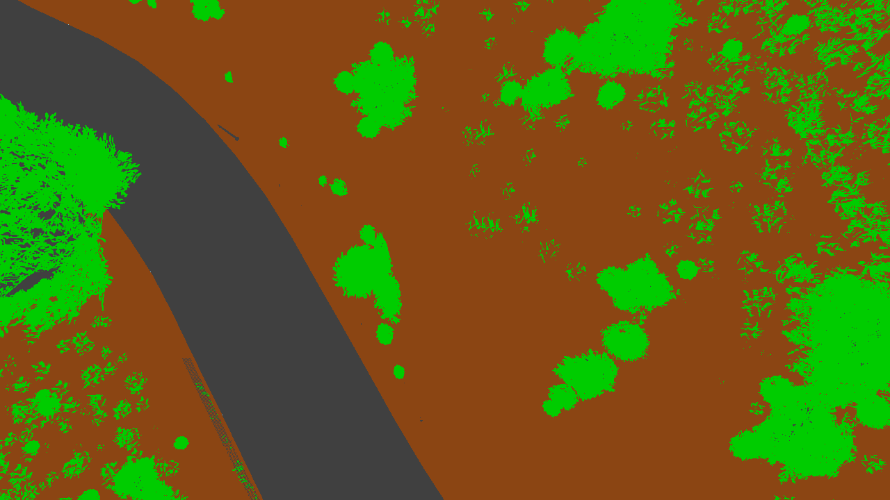

# aerosynth-gtav

ScriptHookV ASI mod for GTA V that captures aerial stereo imagery with depth and segmentation ground truth, for use as synthetic training data in the aerosynth pipeline.

## Hotkeys

| Key | Action |
|-----|--------|
| F6 | Capture single frame |
| F7 | Toggle continuous capture |
| F8 | Teleport to random drone position |
| F9 | Toggle aerial scripted camera / normal game camera |

The scripted camera is positioned 20–50 m above the player with a random pitch (−20° to −90°) and yaw. F8 also clears nearby peds and vehicles, pauses the clock at noon, and locks weather to clear.

## Sample output

Converted frame (`frame_000004`) from the full dataset:

| Left RGB | Right RGB |
|---|---|
|  |  |

| Depth (near=dark, far=bright) | Segmentation |
|---|---|
|  |  |

## Raw output format

Each capture session writes to `captures/YYYY-MM-DD_HH-MM-SS/`:

```
frame_000000.bmp           # left RGB (1280×720)
frame_000000_right.bmp     # right RGB, 1 m stereo baseline
frame_000000_depth.bmp     # depth — 16-bit BI_RGB BMP, 0–65535 = 0–500 m linear view-space Z
frame_000000_seg.bmp       # segmentation — 24-bit false-colour BMP (stencil palette, see below)
frame_000000.json          # camera intrinsics, extrinsics, file paths
...
```

### Depth decoding

```python
depth_metres = pixel_value / 65535.0 * 500.0
```

`pixel_value` is the raw 16-bit integer. The BMP is stored as `BI_RGB` with `BitCount=16` (RGB555 layout) — read raw bytes and interpret as `uint16` rather than using a standard image loader.

### Segmentation palette

The false-colour BMP encodes GTA V stencil buffer classes:

| RGB colour | Stencil | Class |
|---|---|---|
| `(64, 64, 64)` | 0 | Inanimate objects / roads / buildings |
| `(255, 0, 0)` | 1 | Persons |
| `(0, 0, 255)` | 2 | Vehicles |
| `(0, 204, 0)` | 3 | Foliage / trees |
| `(139, 69, 19)` | 4 | Natural ground / terrain |
| `(135, 206, 235)` | 7 | Sky |

### JSON metadata

```json
{
  "timestamp": 1779202684000,
  "frame_number": 0,
  "resolution": { "width": 1280, "height": 720 },
  "camera": {
    "position": { "x": 217.5, "y": 1338.2, "z": 289.0 },
    "rotation": { "x": -45.0, "y": 0.0, "z": 91.0 },
    "intrinsics": { "fov": 50, "near_clip": 0.15, "far_clip": 800, "aspect_ratio": 1.778 }
  },
  "camera_right": { "position": { ... }, "rotation": { ... } },
  "files": { "rgb": "...", "depth": "...", "segmentation": "...", "right": "..." }
}
```

**Coordinate system:** +X = East, +Y = North, +Z = Up. **Euler order:** ZXY (pitch = rotX, yaw = rotZ, roll ignored).

## Downloading the output

A pre-captured dataset is available on Google Drive:

```bash
bash download-output.sh
```

Extracts to `output/` relative to the repo root.

## Converting to normalised format

The raw BMP/JSON layout is not directly usable by the training pipelines. `convert.py` normalises a session directory into a per-frame layout that RAFT-Stereo and SimpleUNet can load:

```bash
conda activate gtav
python convert.py output/<session_dir> --out-dir output/converted
```

### Converted layout

```
output/converted/
  frame_000000/
    left_rgb.png          # left RGB (PNG)
    right_rgb.png         # right RGB (PNG)
    left_depth.npy        # float32 depth in metres
    left_depth.png        # depth visualisation (near=dark, far=bright)
    left_disp.npy         # float32 disparity in pixels (for RAFT-Stereo)
    left_seg_cat.npy      # int32 unified class IDs (see below)
    left_seg_cat.png      # false-colour segmentation (copied from source)
    calib.json            # K matrix, baseline, left/right extrinsics
  frame_000001/
    ...
```

### Unified segmentation class scheme

GTA V stencil IDs are remapped to the aerosynth unified class space (defined in `SimpleUNet/classes.py`):

| GTA V stencil | Unified ID | Class |
|---|---|---|
| 4 | 0 | terrain |
| 3 | 1 | foliage |
| 0 | 3 | artificial |
| 2 | 4 | vehicle |
| 1 | 5 | person |
| 7 | 6 | sky |

Pixels with unrecognised stencil values are set to `−1` (ignored in loss computation). GTA V does not distinguish tree trunk from foliage, so unified class 2 (trunk, from SynthBlend) never appears in GTA V data.

### Disparity

`left_disp.npy` is computed from depth and the intrinsics in `calib.json`:

```
disp = fx × baseline / depth
```

where `fx = K[0][0]` and `baseline = 1.0 m`. Zero-depth pixels produce `disp = 0` (invalid).

### Environment setup

```bash
bash setup-env.sh     # creates the gtav conda env (Python 3.11 + numpy + Pillow)
```

## Build (Windows)

The mod must be built on Windows with an MSVC toolchain.

### MsBuild

```powershell
cmake -B build -DCMAKE_INSTALL_PREFIX="D:\SteamLibrary\steamapps\common\Grand Theft Auto V"
cmake --build build --config Release
```

### Ninja (recommended — enables clangd IntelliSense)

```powershell
& 'C:\Program Files\Microsoft Visual Studio\18\Community\Common7\Tools\Launch-VsDevShell.ps1' -Arch amd64

cmake -B build -G "Ninja" -DCMAKE_INSTALL_PREFIX="D:\SteamLibrary\steamapps\common\Grand Theft Auto V"
cmake --build build --config Release
```

## Installing

[ScriptHookV](https://www.dev-c.com/gtav/scripthookv/) must be present in your GTA V game directory.

```powershell
cmake --install build
```

This copies `aerosynth_gtav.asi` to the game directory configured via `-DCMAKE_INSTALL_PREFIX`. Alternatively, copy the `.asi` manually.

## Dependencies

- CMake ≥ 4.3
- MSVC 19.51+ (Visual Studio 2022)
- Ninja (optional)
- ScriptHookV SDK 1.0.617.1a (vendored in `external/scripthookv_sdk/`)

## Adjustments made during integration

**Depth BMP decoding** — The depth file is a 16-bit `BI_RGB` BMP with `BitCount=16`, which standard image loaders interpret as RGB555 and unpack into three separate 5-bit channels. Decoding required reading the raw pixel bytes as `uint16` via `struct`/`numpy` and applying the linear formula directly, bypassing PIL's channel-splitting behaviour.

**Segmentation palette reverse-engineering** — The seg BMP is a false-colour render of the GTA V stencil buffer. The palette (stencil ID → RGB colour) was determined empirically by capturing frames in known environments and inspecting pixel values, then confirmed against GTA V rendering documentation.

**Google Drive download URL** — `drive.google.com/uc?export=download` returns an HTML confirmation page for files over ~100 MB rather than the file itself. The correct endpoint for direct binary downloads is `drive.usercontent.google.com/download?id=...&export=download&confirm=t`.

**Disparity output** — RAFT-Stereo's data loader expects disparity (pixels), not depth (metres). `convert.py` computes and writes `left_disp.npy` alongside the depth array so the converted layout is a drop-in replacement for SynthBlend poses without requiring any changes to the RAFT-Stereo data loader.

**Unified class scheme** — GTA V stencil IDs are non-contiguous (0, 1, 2, 3, 4, 7) and don't map directly to SynthBlend's 3-class scheme. A 7-class unified label space was defined in `SimpleUNet/classes.py` covering both sources. GTA V stencils are remapped on load; SynthBlend's 0/1/2 labels are already in the unified space.

## Miscellaneous

Kill the game remotely (useful over SSH):

```
taskkill /IM gta5.exe /F
```

## Repository layout

```
src/
  script.cpp          main loop, hotkeys, CaptureFrame, RandomizeDronePosition
  camera.h/cpp        ScriptedCamera — CAM natives, intrinsics/extrinsics
  screencapturer.h/cpp  Windows GDI screen capture → BMP
  depthcapturer.h/cpp   DirectX depth buffer readback → 16-bit BMP
  fileexporter.h/cpp    session directory init, per-frame JSON metadata
  framedata.h         FrameData, CameraIntrinsics, CameraExtrinsics structs
external/
  scripthookv_sdk/    vendored ScriptHookV SDK (headers + .lib)
convert.py            normalises raw capture sessions to per-frame PNG/npy layout
download-output.sh    download pre-captured output from Google Drive
setup-env.sh          creates the gtav conda environment for running convert.py
output/               capture sessions and converted frames (gitignored)
```
